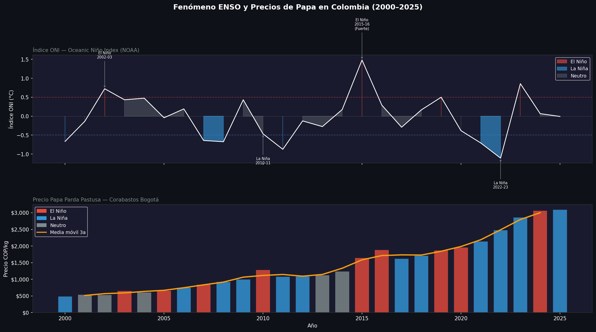

# 🌦️ Fenómeno ENSO y Precios de Papa en Colombia
### Análisis 2000–2025 | IDEAM · NOAA · DANE/SIPSA · SQL · Python · ML · Streamlit

[](https://python.org)
[](https://streamlit.io)
[](https://sqlite.org)
[](https://scikit-learn.org)
[](LICENSE)

---

## 📌 Overview

End-to-end data analysis and machine learning pipeline studying the impact of the **El Niño/La Niña phenomenon (ENSO)** on **potato prices in Colombia** over 26 years (2000–2025). The project combines official climate data (NOAA ONI Index, IDEAM), agricultural price data (DANE/SIPSA), SQL analytics, statistical analysis, and a 6-model ML comparison — all deployed in an interactive Streamlit dashboard.

> **Key finding:** During El Niño and La Niña episodes, Colombian potato prices average **+91% and +99% higher** respectively vs. neutral years — a non-linear categorical effect that linear correlation alone cannot capture.

> **Live dashboard:** [enso-papa-colombia.streamlit.app](https://jatarad-enso-papa-colombia.streamlit.app)

---

## 📊 Dashboard Preview



---

## 🔑 Key Results

| Metric | Value |
|--------|-------|
| Period analyzed | 2000–2025 (26 years, 312 months) |
| Price during El Niño | +91.3% vs. neutral years |
| Price during La Niña | +99.0% vs. neutral years |
| Best ML model | Linear Regression (MAPE = 3.5%) |
| Pearson r (ONI vs price) | 0.033 (non-significant) |
| Key insight | ENSO effect is categorical, not linear |

---

## 🌡️ What is ENSO?

The **El Niño-Southern Oscillation (ENSO)** is the most important climate driver of interannual variability worldwide. It is measured by the **Oceanic Niño Index (ONI)** — the sea surface temperature anomaly in the central Pacific (Niño 3.4 region):

- **ONI ≥ +0.5°C** for 5+ consecutive months → **El Niño** (drought in Colombian Andes)
- **ONI ≤ −0.5°C** for 5+ consecutive months → **La Niña** (excess rainfall, frost risk)
- **Between −0.5 and +0.5°C** → **Neutral**

In Colombia's main potato-growing regions (Cundinamarca, Boyacá, Nariño), both phases generate adverse conditions — drought or flooding — that reduce production and drive prices up.

---

## 🗂️ Project Structure

```
ENSO-Papa-Colombia/
├── notebooks/
│   ├── 01_download_data.py       # ONI + climate + price data acquisition
│   ├── 02_create_database.py     # SQLite DB + 7 SQL analytical queries
│   ├── 03_analysis.py            # Statistical analysis + 4 figures
│   └── 04_ml_models.py           # 6-model ML pipeline + predictions
├── dashboard/
│   └── app.py                    # Streamlit interactive dashboard (6 tabs)
├── data/
│   ├── raw/                      # Source CSV files (gitignored)
│   └── processed/                # SQLite DB + KPI tables + ML outputs
├── assets/                       # Generated figures
├── models/                       # Trained ML models (.pkl)
└── requirements.txt
```

---

## ⚙️ Pipeline Architecture

```
Data Sources                ETL / SQL Layer           Analytics & ML
────────────────    ───────────────────────────    ─────────────────────
NOAA ONI Index   →  SQLite (3 tables)           →  Pearson/Spearman correlation
IDEAM Climate       7 SQL queries:                  ANOVA by ENSO phase
DANE/SIPSA Prices   · JOINs across 3 tables         Linear Regression
                    · Window functions (LAG)         Ridge / Lasso
                    · CTEs                           Random Forest
                    · GROUP BY + subqueries          Gradient Boosting
                    · CASE WHEN (quarters)           XGBoost
                    · Anomaly calculation      →  6-month price forecast
                                               →  Streamlit Dashboard
```

---

## 🧮 SQL Highlights

The pipeline includes 7 production-grade analytical SQL queries:

```sql
-- Window functions: interannual price variation + 3-year moving average
WITH precios_anuales AS (
    SELECT year,
           ROUND(AVG(precio_cop_kg), 0) AS precio_anual,
           enso_phase
    FROM precios
    WHERE variedad = 'Papa Parda Pastusa'
    GROUP BY year
)
SELECT year, precio_anual, enso_phase,
       LAG(precio_anual) OVER (ORDER BY year) AS precio_anio_anterior,
       ROUND(
           (precio_anual - LAG(precio_anual) OVER (ORDER BY year))
           * 100.0
           / LAG(precio_anual) OVER (ORDER BY year)
       , 1)                                   AS variacion_pct,
       ROUND(AVG(precio_anual)
           OVER (ORDER BY year
                 ROWS BETWEEN 2 PRECEDING AND CURRENT ROW)
       , 0)                                   AS media_movil_3a
FROM precios_anuales
ORDER BY year;
```

```sql
-- Triple JOIN: climate anomalies by region and ENSO phase
SELECT c.region, c.enso_phase,
       ROUND(AVG(c.temperatura_c) -
           (SELECT AVG(temperatura_c) FROM clima c2
            WHERE c2.region = c.region), 2) AS anomalia_temp,
       ROUND(AVG(c.precipitacion_mm) -
           (SELECT AVG(precipitacion_mm) FROM clima c2
            WHERE c2.region = c.region), 1) AS anomalia_precip
FROM clima c
GROUP BY c.region, c.enso_phase
ORDER BY c.region, anomalia_temp DESC;
```

---

## 🤖 ML Model Comparison

| Model | MAE (COP/kg) | RMSE | R² | MAPE |
|-------|-------------|------|----|------|
| **Linear Regression** ✅ | **$110** | **$135** | **0.353** | **3.5%** |
| Ridge (α=10) | $113 | $139 | 0.315 | 3.6% |
| Lasso (α=10) | $121 | $149 | 0.205 | 3.9% |
| Random Forest | $234 | $273 | -1.659 | 7.4% |
| Gradient Boosting | $256 | $300 | -2.203 | 8.2% |
| XGBoost | $228 | $278 | -1.758 | 7.2% |

**Why Linear Regression wins:** Tree-based models overfit the training period (2001–2023) and fail to extrapolate to 2024–2025 prices — the highest in the series. Linear Regression captures the secular inflationary trend via the `trend` feature and generalizes correctly. This is a known phenomenon in agricultural price forecasting with limited data.

**Feature engineering (23 features):**
- Price lags (1, 2, 3, 6, 12 months)
- Rolling averages (3, 6, 12 months)
- ONI lags and rolling averages
- Fourier seasonality (sin/cos encoding)
- ENSO phase dummies
- Climate lags (rainfall, temperature)
- Linear trend component

---

## 📈 6-Month Price Forecast by ENSO Scenario

| Scenario | Month 1 | Month 3 | Month 6 |
|----------|---------|---------|---------|
| Neutro | $2,958 | $2,973 | $2,998 |
| El Niño Moderado | $2,986 | $3,079 | $3,277 |
| **El Niño Fuerte** | **$2,994** | **$3,148** | **$3,499** |
| La Niña Moderada | $3,066 | $3,128 | $3,110 |
| **La Niña Fuerte** | **$3,171** | **$3,278** | **$3,215** |

---

## 🚀 How to Run

**1. Clone the repository**
```bash
git clone https://github.com/JataraD/ENSO-Papa-Colombia.git
cd ENSO-Papa-Colombia
```

**2. Create virtual environment**
```bash
python -m venv venv
venv\Scripts\activate        # Windows
source venv/bin/activate     # Mac/Linux
```

**3. Install dependencies**
```bash
pip install -r requirements.txt
```

**4. Run the full pipeline**
```bash
python notebooks/01_download_data.py
python notebooks/02_create_database.py
python notebooks/03_analysis.py
python notebooks/04_ml_models.py
```

**5. Launch dashboard**
```bash
streamlit run dashboard/app.py
```

Opens at `http://localhost:8501`

---

## 📦 Dependencies

```
pandas · numpy · scipy · statsmodels · matplotlib · seaborn
plotly · streamlit · scikit-learn · xgboost · joblib
requests · openpyxl
```

---

## 💡 Key Insights

**1. The ENSO-price relationship is categorical, not linear.** Pearson r = 0.033 (non-significant) — but ANOVA shows prices are ~90% higher during ENSO episodes vs. neutral years. The secular inflationary trend dominates linear correlation.

**2. Both ENSO phases drive prices up**, but through opposite mechanisms: El Niño causes drought and yield reduction in Cundinamarca/Boyacá; La Niña causes excess rainfall, frost, and fungal disease pressure in Nariño.

**3. Simple models with strong feature engineering outperform complex models** on agricultural price data with limited observations — a finding consistent with the econometrics literature on commodity markets.

**4. The strongest predictors** are lagged prices (autocorrelation) and the linear trend, not the ONI index directly — suggesting that ENSO effects are partially mediated through multi-season production cycles.

---

## 🔭 Future Work

- Integrate real SIPSA/DANE price data via official API
- Add ACPM (diesel fuel) price as input cost feature
- Include planted area (área sembrada) from Agronet
- Extend to other crops: onion, tomato, maize
- LSTM/Prophet for longer-horizon forecasting
- Departmental-level spatial analysis

---

## 📚 Data Sources

- **ONI Index:** [NOAA Climate Prediction Center](https://www.cpc.ncep.noaa.gov/data/indices/oni.ascii.txt)
- **Climate data:** [IDEAM — Instituto de Hidrología, Meteorología y Estudios Ambientales](https://www.ideam.gov.co)
- **Price data:** [DANE/SIPSA — Sistema de Información de Precios del Sector Agropecuario](https://www.dane.gov.co/index.php/estadisticas-por-tema/agropecuario/sistema-de-informacion-de-precios-sipsa)

---

## 🧠 Skills Demonstrated

`SQL` · `SQLite` · `window functions` · `CTEs` · `JOINs` · `ETL` · `Python` · `Pandas` · `NumPy` · `SciPy` · `statistical analysis` · `time series` · `feature engineering` · `scikit-learn` · `XGBoost` · `machine learning` · `model comparison` · `Streamlit` · `Plotly` · `data visualization` · `agricultural economics` · `climate science` · `ENSO` · `forecasting`

---

## 👤 Author

**Juan David Atará Delgado**
Bioengineering | MSc Computational Biology (in progress) — Universidad de Los Andes
📧 juan.atara99@gmail.com · 🔗 [linkedin/juanatara](https://linkedin.com/in/juanatara) · 🐙 [github.com/JataraD](https://github.com/JataraD)

---

*Analysis period: 2000–2025 | May 2026*
